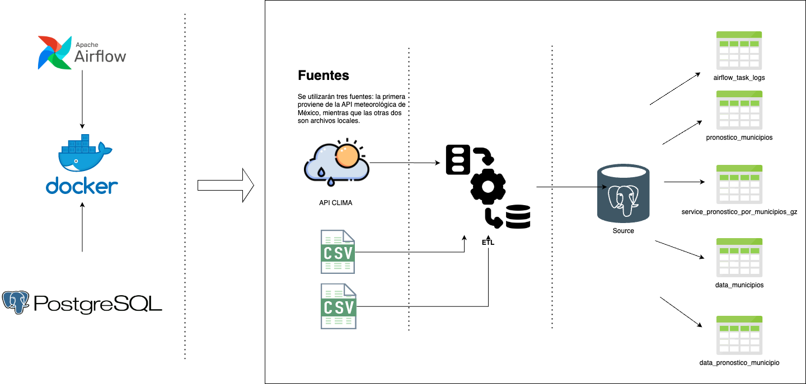

# **Estudio de Caso: Integración de Datos Climáticos para Análisis en Ciencia de Datos**

Examinaremos el desafío que enfrenta un equipo de Ciencia de Datos en México al incorporar datos climáticos en su conjunto de datos para un análisis posterior. El objetivo principal es adquirir y preparar los datos climáticos para su posterior consumo y análisis. El equipo ha identificado un servicio web proporcionado por la Comisión Nacional del Agua(CONAGUA) que ofrece información climática detallada a nivel municipal y por hora.

## Objetivos

1. **Obtener Datos Climáticos:** Consumir periódicamente los registros climáticos más recientes de cada municipio a través del servicio web  https://smn.conagua.gob.mx/es/web-service-api que se actualizan cada hora.
2. **Crear Tabla de Resúmenes Climáticos:** Generar una tabla que incluya el promedio de temperatura y la precipitación de las últimas dos horas para cada municipio. Estos resúmenes climáticos servirán como datos preparados para análisis posteriores.
3. **Integrar Datos Climáticos y Municipales:** Combinar los datos climáticos generados con los datos municipales existentes que se encuentran en archivos csv disponibles localmente.


## Arquitectura

## Estructura del proyecto


Estos son los archivos y directorios más relevantes del proyecto:
```
.
├── docker #Python dependencies
├── airflow
├── Dockerfile
├── requirements.txt
├── start-airflow.sh
postgres
├── Dockerfile
├── init-hive-db.txt
├──mnt
├── airflow
├── dags/
├── .env
├── docker-compose
```
# Comenzando


## Requisitos de instalación


- [Docker](https://docs.docker.com/install/) `2.1.0.1` or greater.


# **Iniciando**
* Una vez descargada la version de [Docker](https://docs.docker.com/desktop/release-notes/#4120) lo primero es clonar el repositorio con el comando ``git clone`` seguido de la url del repositorio
* Tendremos que ubicarnos en carpeta que se creó, y verificamos que esté en la rama ``master``
* Ejecutamos en la terminal el comando ``docker-compose up -d ``
* Si es la primera vez que crea este contenedor en su máquina toma unos minutos crearla, ya que debe instalar las dependencias.
* Si todo sale bien, ya podrá ver su contenedor en docker, para verificar esto puede escribir ``docker ps`` debería ver algo similar a esto
```
CONTAINER ID IMAGE COMMAND CREATED STATUS PORTS NAMES
d21e8f31c4ae wodby/adminer:latest "/entrypoint.sh php …" 30 hours ago Up 4 hours (healthy) 0.0.0.0:32767->9000/tcp adminer
17a96c83c494 reto-data_dd360-airflow "./start-airflow.sh" 2 days ago Up 4 hours (unhealthy) 0.0.0.0:8080->8080/tcp airflow
529c034214dc reto-data_dd360-postgres "docker-entrypoint.s…" 2 days ago Up 4 hours (healthy) 0.0.0.0:32769->5432/tcp postgres_reto
```


* Una vez que construido y ejecutado Airflow, abra un navegador web y navegue a [http://localhost:8080](http://localhost:8080).
Utilice las siguientes credenciales predeterminadas para iniciar sesión:

    - usuario: airflow
    - Contraseña: airflow

* También puedes acceder al servicio de Adminer en el host [http://localhost:32767](http://localhost:32767/). Adminer es una herramienta de gestión de bases de datos en PHP que es ligera y de un solo archivo. Es similar en funcionalidad a phpMyAdmin, pero es más ligera y fácil de instalar debido a su naturaleza de archivo único
* Cómo acceder a la base de datos: en el archivo ``start-airflow.sh`` se ejecuta una serie de sentencias con el fin de crear un usuario y una base de datos para este ejemplo:


- user: curso_user
- password: curso_password
- base de datos: curso


# **Exploremos el Código**


### En Apache Airflow, el código que define los flujos de trabajo (DAGs) debe colocarse en una carpeta específica conocida como la "carpeta DAG". Hay varias razones para esto:


- Escáneo Automático: Airflow escanea automáticamente la carpeta DAG en busca de nuevos archivos o cambios en los archivos existentes para detectar y cargar nuevos DAGs o actualizaciones. Si los archivos DAG no están en esta carpeta, Airflow no los reconocerá.


- Organización: Tener una carpeta específica para los DAGs ayuda a mantener el código organizado. Separa los flujos de trabajo (DAGs) de otros componentes o configuraciones de Airflow.


- Configurabilidad: Aunque "dags" es la carpeta predeterminada, puedes configurar la ubicación exacta de esta carpeta en el archivo de configuración de Airflow (airflow.cfg) mediante la opción dags_folder. Esto te da flexibilidad en caso de que desees cambiar la ubicación por razones de estructura de proyecto o permisos.


- Aislamiento: Mantener los DAGs en una carpeta separada puede ser útil para cuestiones de permisos y seguridad. Por ejemplo, podrías querer restringir el acceso a esta carpeta para evitar cambios no autorizados en tus flujos de trabajo.


- Facilita la Colaboración: Si estás trabajando en un equipo, tener una carpeta dedicada para DAGs facilita la colaboración, ya que los miembros del equipo saben exactamente dónde encontrar y colocar los flujos de trabajo.


Sabiendo esto vamos a explorar lo construido para que funcione este proceso.


## Documentación de Funciones para Airflow `settings.py`


---


### Constantes


- **`POSTGRES_CONN_ID`**:
- **Descripción**: Define la conexión a PostgreSQL utilizada en Airflow.


---


### Funciones


---


#### `get_default_args()`
**Descripción**: Devuelve un diccionario con argumentos predeterminados para definir un DAG en Airflow.


---


#### `execute_postgres(sql, postgres_conn_id, with_cursor=False)`
**Descripción**: Ejecuta una consulta SQL en PostgreSQL y devuelve los resultados.


- **Parámetros**:
- `sql`: La consulta SQL a ejecutar.
- `postgres_conn_id`: El ID de la conexión a PostgreSQL.
- `with_cursor`: Si es `True`, devuelve el cursor junto con los resultados.


---


#### `update_logs(details)`
**Descripción**: Actualiza o inserta registros en la tabla `AIRFLOW_TASK_LOGS` basado en la información proporcionada.


- **Parámetros**:
- `details`: Un diccionario con detalles sobre la tarea de Airflow.


---


#### `set_alert_handling(context)`
**Descripción**: Maneja alertas y registra detalles sobre la tarea de Airflow.


- **Parámetros**:
- `context`: El contexto de la tarea proporcionado por Airflow.


---


#### `on_error_call(context)`
**Descripción**: Función callback llamada cuando una tarea falla.


- **Parámetros**:
- `context`: El contexto de la tarea proporcionado por Airflow.


---


#### `on_success_call(context)`
**Descripción**: Función callback llamada cuando una tarea se completa exitosamente.


- **Parámetros**:
- `context`: El contexto de la tarea proporcionado por Airflow.


## Clase `WeatherForecast ` `weather_api.py `
Esta clase se encarga de manejar las operaciones relacionadas con la obtención y procesamiento de los datos de pronóstico del tiempo.


---


### Constructor `__init__(self, url, headers)`


Inicializa una instancia de la clase `WeatherForecast`.


**Parámetros**:
- `url`: URL desde donde se obtendrán los datos.
- `headers`: Encabezados para la solicitud HTTP.


---


### Método `fetch_weather_data(self)`


Realiza una solicitud HTTP para descargar datos comprimidos de pronóstico del tiempo desde la URL especificada. Luego, descomprime el archivo y lo convierte en un DataFrame de pandas.


**Retorno**:
- DataFrame con los datos del pronóstico del tiempo o `None` si hubo un error.


---


### Método `get_latest_records(self, data)`


Obtiene los registros más recientes de los datos proporcionados.


**Parámetros**:
- `data`: DataFrame con los datos del pronóstico del tiempo.
**Retorno**:
- DataFrame con los registros más recientes o `None` si hubo un error.


---


### Método `save_to_local(self, df, file_path)`


Guarda los datos proporcionados en un archivo CSV local.


**Parámetros**:
- `df`: DataFrame con los datos a guardar.
- `file_path`: Ruta donde se guardará el archivo.
**Retorno**:
- `True` si los datos se guardaron correctamente, `False` en caso contrario.


---


## Función `run_weather_forecast_pipeline(url, headers, file_name)`


Ejecuta el pipeline completo de extracción, procesamiento y almacenamiento de los datos de pronóstico del tiempo.


**Parámetros**:
- `url`: URL desde donde se obtendrán los datos.
- `headers`: Encabezados para la solicitud HTTP.
- `file_name`: Nombre del archivo donde se guardarán los datos.


# Weather Data DAG


Este módulo define un Directed Acyclic Graph (DAG) en Airflow para la adquisición, procesamiento y almacenamiento de datos de pronóstico del tiempo.


## Importaciones


- **Librerías estándar**: Se utilizan para operaciones básicas como manipulación de fechas, registro (logging) y manejo de archivos.
- **Librerías de terceros**: Incorporan funcionalidades específicas de Airflow, manejo de bases de datos y operaciones con datos.
- **Módulos locales**: Se refieren a módulos específicos del proyecto que proporcionan funcionalidades adicionales.


## Constantes y Variables


- `QUERIES_BASE_PATH`: Ruta donde se encuentran las consultas SQL.
- `FILE_LOCAL`: Lista de nombres de archivos locales.
- `MEXICO_TIMEZONE`: Zona horaria de México.
- `URL` y `HEADERS`: Variables de Airflow para interactuar con la API de CONAGUA.


## Funciones


### `load_data_to_postgres(file_path, table_name, **kwargs)`


Carga datos desde un archivo CSV en una tabla de PostgreSQL.


**Parámetros**:
- `file_path`: Ruta del archivo CSV.
- `table_name`: Nombre de la tabla en la que se cargarán los datos.


## DAG Definition


Se define un DAG con el nombre `'weather_data_dag'`. Este DAG se encarga de extraer datos de pronóstico del tiempo, procesarlos y almacenarlos.


### Tareas (Tasks) del DAG:


1. `run_this`: Ejecuta un script SQL para copiar datos.
2. `load_data_task`: Carga datos del pronóstico del tiempo en una tabla temporal de PostgreSQL.
3. `pronostico_municipios`: Ejecuta una consulta SQL relacionada con el pronóstico por municipios.
4. `data_pronostico`: Ejecuta una consulta SQL para obtener datos de pronóstico.
5. `local_load`: Ejecuta el pipeline de pronóstico del tiempo y guarda los datos en un archivo CSV.
6. `trancate_table`: Ejecuta una consulta SQL para truncar y/o crear una tabla.


## Dependencias entre tareas


Las tareas se ejecutan en un orden específico, definido por las dependencias entre ellas. Estas dependencias aseguran que los datos se procesen y almacenen en el orden correcto.
